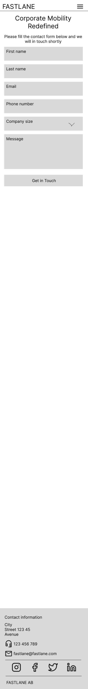

# FASTLANE Corporate Mobility

This fictional website is inspired by my experience in business travel and B2B sales. It introduces FASTLANE — a next-gen corporate mobility solution that empowers companies to streamline travel programs, reduce costs, and elevate service quality through personalized self-service and smart automation.

FASTLANE means speed and simplicity.
Built for businesses that move fast and think smarter, FASTLANE delivers optimized processes, real-time insights, and a seamless travel experience — all under one sleek platform.

---

## CONTENTS

- [User Experience](#user-experience-ux)

  - [User Stories](#user-stories)

- [Design](#design)
  - [Structure](#structure)
  - [Wireframes](#wireframes)
  - [Colour Scheme](#colour-scheme)
  - [Typography](#typography)
  - [Imagery](#imagery)

---

## User Experience (UX)

### Business Goals

- The main goal of this website is to attract B2B clients
- Build professional website that supports lead generation
- Clearly communicating FASTLANE’s value and what differentiates it from competitors
- Encourage visitors to take action through strong CTAs

### User Stories

#### User Story 1: First Impression

As a first-time visitor, I want the site to be easy to access and navigate, so I want to use it.

**Acceptance Criteria**

- Works well on desktop, tablet, and mobile
- Clear and simple navigation
- Layout doesn’t break or overlap at any screen size

**Tasks**

- Use mobile-first design
- Add responsive navbar (Bootstrap)
- Check spacing and layout on all screen sizes

#### User Story 2: Key Benefits

As a potential B2B customer, I want to quickly understand the benefits, so I can decide if FASTLANE is worth my time.

**Acceptance Criteria**

- A section with 3 short benefit cards
- Each has a title and 1-sentence explanation

**Tasks**

- Create 3 cards (Cost Savings, Fast Booking, Self-Service)
- Add icons, hover shadow effect
- Make sure cards look good on all screen sizes

#### User Story 3: Explore Services

As potential B2B client, I want to see what services FASTLANE offers, so I can check if it fits our needs.

**Acceptance Criteria**

- A section that lists main services
- Each has a short title and clear description

**Tasks**

- List services:
- Self-service travel platform
- Hotel + flight booking with corporate rates
- Custom travel policies
- 24/7 support
- Expense + invoice tools
- Reporting + analytics
- Add icons or visuals
- Write short benefit-focused descriptions

#### User Story 4: Build Trust

As a decission-maker, I want to know FASTLANE is reliable, so I can feel good about using it.

**Acceptance Criteria**

- A “Why FASTLANE” section
- Testimonials

**Tasks**

- Write a “Why FASTLANE” block with key points
- Add 3 short testimonials

#### User Story 5: Call-to-Action (CTA)

As a lead, I want to easily reach out or book a demo, so I can get started.

**Acceptance Criteria**

- Clear CTA button on homepage
- CTA links to contact or demo form

**Tasks**

- Write buttons like “Get in Touch” or “Book a Demo”
- Place buttons in hero and after key sections
- Create contact form or demo page with company info

#### User Story 6: Contact Section & Footer

As a visitor, I want to quickly find contact details, so I can reach out.

**Acceptance Criteria**

- A visible contact section
- Footer with essential company info and links

**Tasks**

- Add a contact section with:
  - Email
  - Phone
  - Office
  - Company name

## Design

### Structure

**Landing Page**

- Hero Section
- Key Benefits
- Teaser with link to full Services page
- CTA (Get in Touch / Book Demo)

**Services**

- List of services with icons/visuals
- Short, benefit-focused descriptions for each service
- CTA to contact or demo

**About**

- “Why FASTLANE” section
- Client testimonials
- Company mission and vision
- CTA for contacting or demo

**Contact**

- Contact form

### Wireframes

- Wireframes were created using the Figma platform

##### Mobile Wireframes

