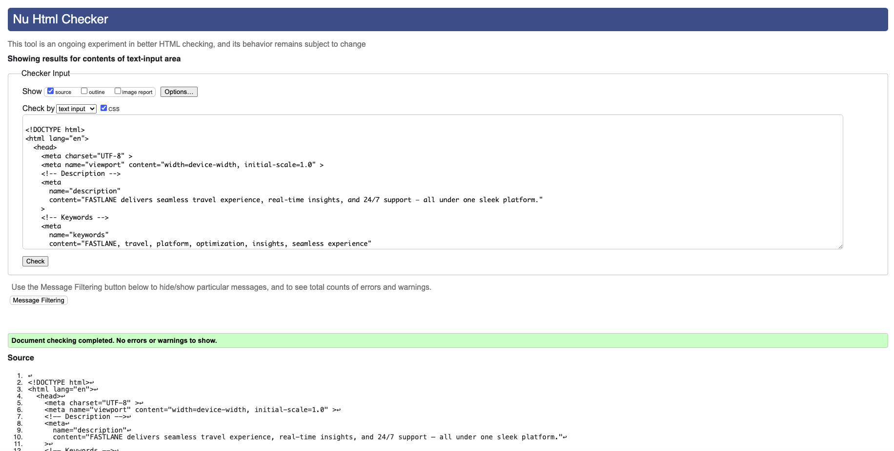
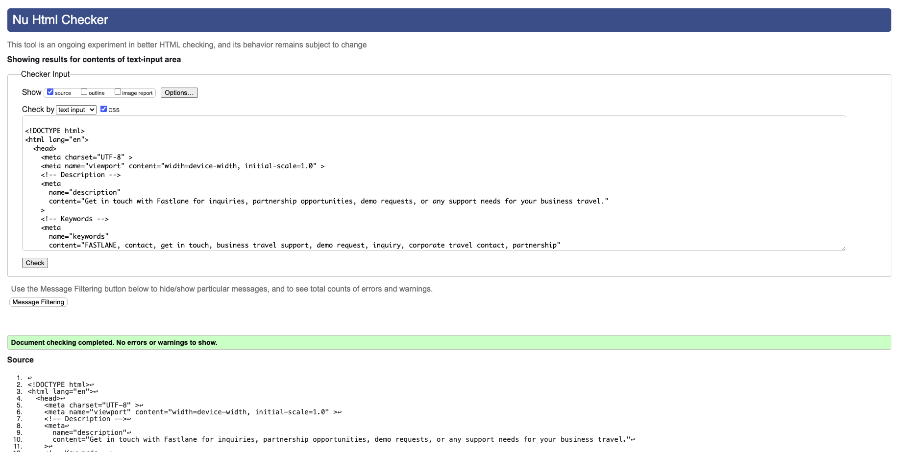
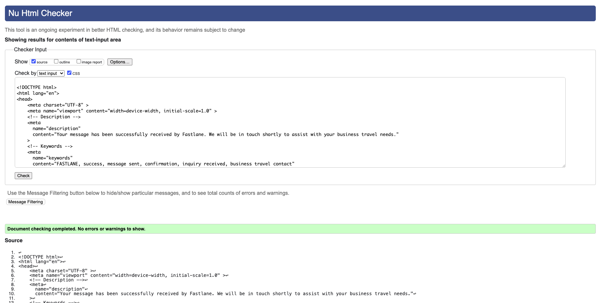
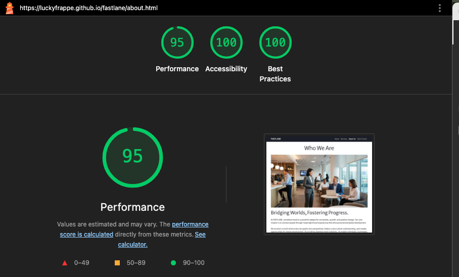
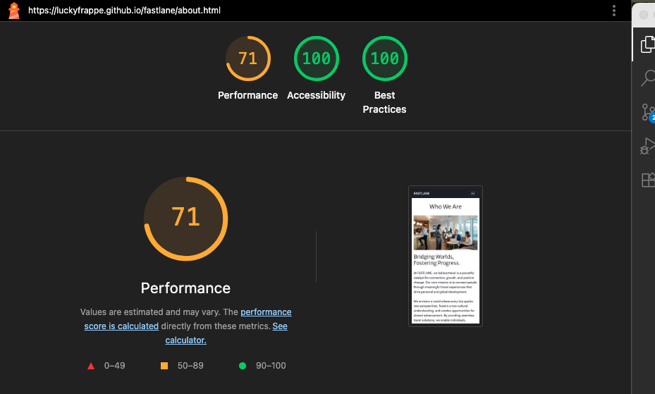
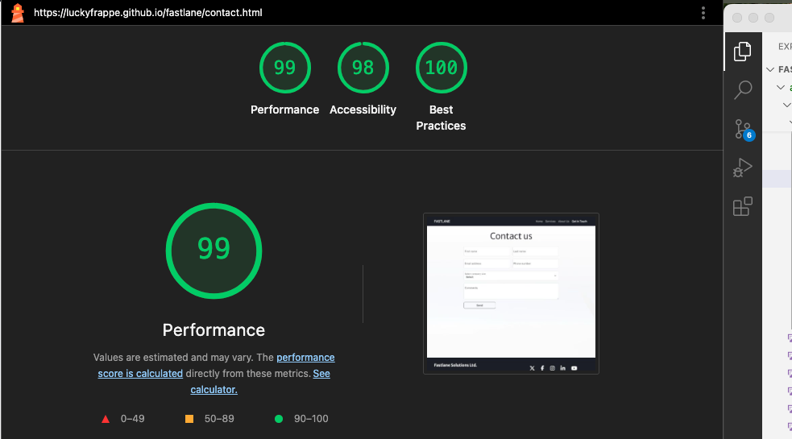
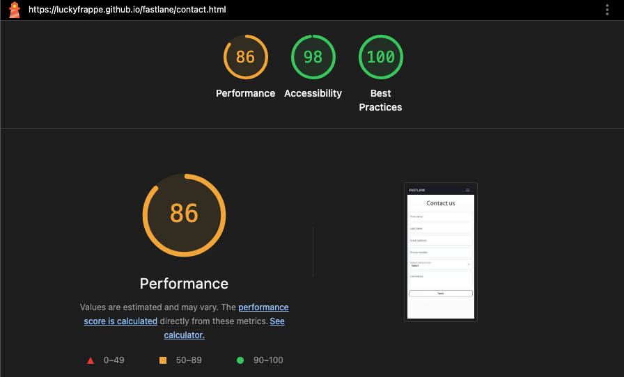
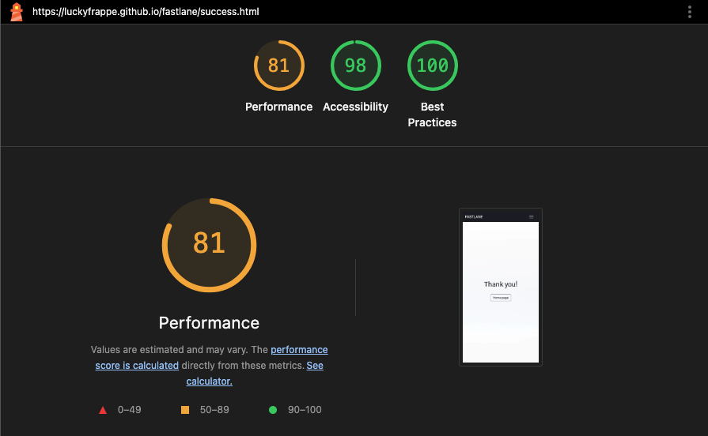
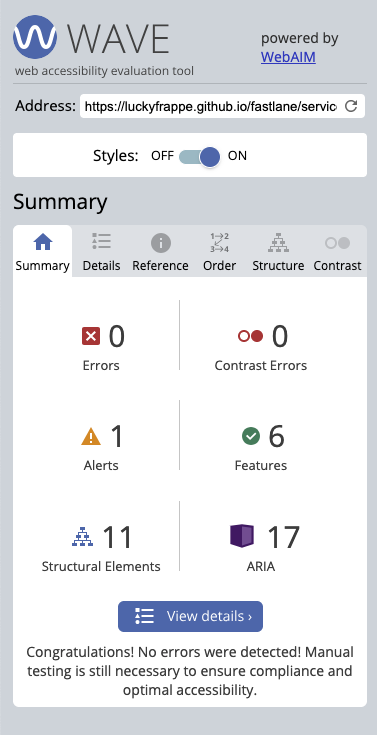
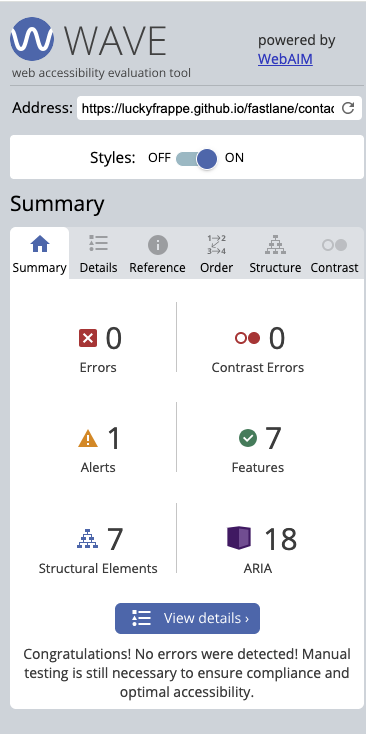

# FASTLANE Corporate Mobility

This fictional website is inspired by my experience in business travel and B2B sales. It introduces FASTLANE — a next-gen corporate mobility solution that empowers companies to streamline travel programs, reduce costs, and elevate service quality through personalized self-service and smart automation.

<a href="https://luckyfrappe.github.io/fastlane/" target="_blank" aria-labe="FASTLANE website opens in a new window on Github Pages">View FASTLANE on Github Pages</a>

## CONTENTS

* [User Experience (UX)](#user-experience-ux)  
  * [Business Goals](#business-goals)  
  * [User Stories](#user-stories)  
* [Design](#design)  
  * [Color Scheme](#color-scheme)  
  * [Typography](#typography)  
  * [Imagery](#imagery)  
  * [Wireframes](#wireframes)  
* [Features](#features)  
  * [Common to All Pages](#common-to-all-pages)  
  * [Page-Specific Features](#page-specific-features)  
  * [Future Implementations](#future-implementations)  
  * [Accessibility Considerations](#accessibility-considerations)  
* [Technologies Used](#technologies-used)  
  * [Languages Used](#languages-used)  
  * [Frameworks, Libraries & Programs Used](#frameworks-libraries--programs-used)  
* [Deployment & Local Development](#deployment--local-development)  
  * [Deployment](#deployment)  
  * [Local Development](#local-development)  
    * [How to Fork the Repository](#how-to-fork-the-repository)  
    * [How to Clone the Repository](#how-to-clone-the-repository)  
* [Testing](#testing)  
  * [Automated Testing](#automated-testing)  
  * [Manual Testing](#manual-testing)  
  * [Bugs](#bugs)  
    * [Known Bugs](#known-bugs)  
    * [Solved Bugs](#solved-bugs)  
* [Credits](#credits)  
  * [Code Used](#code-used)  
  * [Content](#content)  
  * [Media](#media)  
  * [Acknowledgments](#acknowledgments)

---

## User Experience (UX)

### Business Goals

- The main goal of this website is to attract B2B clients
- Build professional website that supports lead generation
- Clearly communicating FASTLANE’s value and what differentiates it from competitors
- Encourage visitors to take action through strong CTAs

### User Stories

**As a first-time visitor, I want the site to be easy to access and navigate, so I want to use it**

- Works well on desktop, tablet, and mobile
- Clear and simple navigation
- Layout doesn’t break or overlap at any screen size

**As a potential B2B customer, I want to quickly understand the benefits, so I can decide if FASTLANE is worth my time**

- A section with 3 short benefit cards
- Each has a title and 1-sentence explanation

**As potential B2B client, I want to see what services FASTLANE offers, so I can check if it fits our needs**

- A section that lists main services
- Each has a short title and clear description

**As a decission-maker, I want to know FASTLANE is reliable, so I can feel good about using it.**

- A “Why FASTLANE” section
- Testimonials

**As a lead, I want to easily reach out or book a demo, so I can get started**

- Clear CTA button on homepage
- CTA links to contact or demo form

**As a visitor, I want to quickly find contact details, so I can reach out**

- A visible contact section
- Footer with essential company info and links

## Design

### Color Scheme

This project's design embodies a philosophy of simplicity, utilizing three carefully selected neutral colors to create a refined and uncluttered aesthetic where 'less is more'.

### Thypography

For typography, Merriweather Sans (sourced from Google Fonts) is employed for all headings, lending a distinct yet web-friendly appeal. Roboto Flex (also from Google Fonts) is used for paragraph text, ensuring readability and a professional, modern feel — qualities highly valued in the corporate travel industry.

### Imagery

All visual content, including images and videos, was generated by Gemini by Google to evoke a positive feeling of high-level corporate travel. Additional royalty-free images were sourced from <a href="https://www.pexels.com/" target="_blank" rel="noopener">Pexels</a>. Full author credits for all assets can be found in the dedicated <a href="#credits">Credits section</a> of this project.

### Features

This website is designed to provide a seamless and professional experience for managing business travel, offering a robust set of features across its key sections:

**Common to All Pages:**

- Responsive Navigation Bar: Top navigation bar ensures intuitive site navigation. It features the FASTLANE branding and essential links (Home, Services, About, Get in Touch). For an optimal user experience on mobile devices, the navigation condenses into a universally recognized burger menu, maintaining a clean interface.
- Footer: A functional footer houses social media icon links (e.g., LinkedIn, Instagram). Icons are chosen for their universal recognition and minimalist design.

**Page-Specific Features:**

**Landing Page:**

- Hero Section: An impactful introduction setting the tone for effortless corporate travel.
- Services Teaser: A concise overview teasing the comprehensive offerings, with a clear link "See all services"to the full Services page, inviting users to explore further.
- Key Benefits: Highlights the core advantages of using FASTLANE,
- CTA: "Get in Touch" button.

**Services Page:**

- Presents a magazine like list of FASTLANES's services, enhanced with appropriate images.
- Each service includes a concise, benefit-focused description.
- CTA: "Get in Touch" button.

**About us Page:**

- Vision: Clearly outlines the company's purpose and future aspirations in connecting people through travel for progress.
- "Why FASTLANE?" Section: Articulates the unique value proposition and advantages of choosing FASTLANE.
- Client Testimonials: Showcases positive feedback from satisfied clients, building trust and credibility.
- CTA: "Get in Touch" button.

**Contact Page:**

- Provides a straightforward contact form for user inquiries.
- Includes essential fields such as name, email, and a message area, with clear validation hints for required information.

**Success Page:**

- Displayed upon successful form submission, providing immediate confirmation to the user.

### Future Implementations
Here are some super simple ideas for future implementations for your FASTLANE project, focusing on enhancements primarily achievable with HTML and CSS, suitable for your README:

---

### Future Implementations

Plans to further enhance the FASTLANE website's user experience and visual appeal. Future implementations could include:

- Dynamic Service Section Carousels: Implementing a simple carousel (e.g., using Bootstrap's carousel component) within the services section cards to displaymultiple images or variations for each service.
- Back to Top" Button: Adding a convenient floating button that appears after scrolling down, allowing users to quickly return to the top of long pages.
Themed Loading Animations: Creating simple CSS animations for page transitions or form submissions to provide visual feedback to the user.

### Accessibility Considerations

- Semantic HTML: Utilizing meaningful HTML tags to ensure proper document structure for assistive technologies.
- Descriptive Alt Attributes: All images include descrpitions for screen reader users.
- Color Contrast: Simple black and white contrast across the site for readability.
- Accessible Navigation: Current page links are clearly marked for screen readers, enhancing navigability.

### Wireframes

Wireframes were created for mobile and dekstop

  
Home page

  

    
    
  

  
Services page

  

    
    
  

  
About us page

  

    
    
  

  
Contact page

  

    
    
  

  
Thank you page

  

    
    
  

## Technologies Used

### Languages Used

HTML and CSS.

### Frameworks, Libraries & Programs Used

Figma platform - used to create wireframes

Git - For version control.

Github - To save and store the files for the website.

Bootstrap Version 5.3.6 - The primary front-end framework that provides responsive grid systems, pre-built UI components, and JavaScript functionalities.

Google Fonts - Import fonts.

Google Dev Tools - Development.

Font Awesome - Import icons.

<a href="https://www.freeconvert.com/">FreeConvert</a> - To downsize and convert the hero video.

<a href="https://favicon.io/">Favicon.io</a> - To create favicon.

<a href="https://tinypng.com/">Tiny PNG</a> - To downsize the images.

<a href="http://ami.responsivedesign.is/">Am I Responsive?</a> - To showcase the website on different devices.

<a href="https://autoprefixer.github.io/">Autoprefixer CSS online</a> - Applied to add necessary vendor prefixes to CSS properties, ensuring broader browser compatibility.

ChatGPT (by OpenAI) - Used for generating specific service and feature descriptions, ensuring industry relevance and authenticity in the website's content.

Gemini (by Google) - Used for generating custom imagery and video content used on the website, as well as providing extensive debugging assistance and code explanations during development.

## Deployment & Local Development

  
Deployment

  

    This project's live version is deployed using **GitHub Pages**. Follow these steps to deploy your own instance:

1.  **Access GitHub:** Sign in to your GitHub account.
2.  **Navigate to Repository:** Locate the `FASTLANE` repository for this project.
3.  **Open Settings:** Click on the "Settings" tab within the repository navigation.
4.  **Go to Pages:** In the left-hand sidebar, select the "Pages" option.
5.  **Configure Source:**
    - Under the "Source" section, choose the `main` branch from the branch dropdown menu.
    - Select `/(root)` as the folder from the adjacent dropdown.
6.  **Save Changes:** Click the "Save" button. Your live site will now be accessible at the URL provided by GitHub Pages, typically `https://[your-username].github.io/fastlane/`.
  

### **Local Development**

To get a local copy of this project up and running on your machine, you have two primary methods: Forking and Cloning.

  
How to Fork the Repository

  

    Forking creates a personal copy of the repository in your GitHub account, allowing you to make changes without affecting the original project.

1.  Sign In: Log in to your GitHub account.
2.  Go to Project: Visit the `luckyfrappe/fastlane` repository.
3.  Initiate Fork: Click the "Fork" button located in the top-right corner of the page. This will create a copy under your own GitHub profile.
  

  
How to Clone the Repository

  

    Cloning downloads a full copy of the repository to your local computer, ready for development.

1. Access GitHub: Ensure you are logged into your GitHub account.
2. Locate Repository: Navigate to the `luckyfrappe/fastlane` repository (or your forked version).
3. Copy Clone URL: Click on the green "< > Code" button. Choose your preferred method (HTTPS, SSH, or GitHub CLI) and copy the provided URL.
4. Open Terminal: Launch your terminal or command prompt (e.g., Git Bash, PowerShell, macOS Terminal).
5. Navigate to Desired Directory: Change your current working directory to where you want to store the project.
   Example: `cd Desktop/Projects`
6. Execute Clone Command: Type `git clone` followed by pasting the URL you copied in step 3. Press Enter.
Example: `git clone https://github.com/luckyfrappe/fastlane.git`
  

## Testing

Quality assurance was a continuous part of this project's development lifecycle. Throughout the entire build process, I employed a rigorous testing methodology to ensure the optimal performance and user experience of the FASTLANE platform.

My primary focus during testing involved:

- Responsive Design Validation: Meticulous checks were performed across a spectrum of device sizes and orientations to confirm that all features and layouts adapted seamlessly, providing a consistent and intuitive experience regardless of screen dimensions.
- Feature Verification: Every implemented feature, from navigation elements to interactive forms and content display, was rigorously tested to confirm flawless operation.

I actively utilized browser developer tools (such as Chrome Developer Tools) to resolve any issues promptly as they arose. This proactive approach ensured that all functionalities performed as intended, contributing to a robust and reliable user interface. Any identified discrepancies were addressed to guarantee that all aspects of the website operate perfectly, delivering a smooth and efficient experience.

### Automated Testing

<a href="https://luckyfrappe.github.io/fastlane/">Live site</a>

Automated testing involved the use of various external tools and validators to systematically check the website's code quality, performance, and accessibility.

**W3C HTML Validator**
The W3C Markup Validation Service was utilized to validate the HTML structure of each page, ensuring adherence to web standards.

  
Results

  

    Landing Page (Home): 
     
    Services Page: 
     
    About Page: 
     
    Contact Page: 
     
    Success Page: 
     
  

 

**CSS Validator**
The W3C CSS Validation Service was used to ensure the CSS stylesheets conform to standards.

  
Results

  

    
  

 

**Lighthouse**
Lighthouse, integrated into Chrome Developer Tools, was used to audit the performance, accessibility and best practices.
Landing Page (Home):

  
Results

  

    Landing Page (Home): 
     
     
    Services Page: 
     
     
    About Page: 
     
     
    Contact Page: 
     
     
    Success Page: 
     
    
  

 

**WAVE Accessibility Tool**
The WAVE Web Accessibility Evaluation Tool was utilized to identify accessibility errors on each page.

  
Results

  

    Landing Page (Home): 
     
    Services Page: 
     
    About Page: 
     
    Contact Page: 
     
    Success Page: 
     
  

### Manual Testing

Testing User Stories
Each user story defined for the FASTLANE project was thoroughly tested to ensure its successful implementation.

- As a first-time visitor, I want the site to be easy to access and navigate.  
Outcome: The site is fully responsive and navigable across desktop, tablet, and mobile, with a stable layout.

- As a potential B2B customer, I want to quickly understand the benefits. 
Outcome: A clear "Benefits" section on the Landing Page highlights key advantages concisely.

- As a potential B2B client, I want to see what services FASTLANE offers. 
Outcome: Main services are listed on the Landing Page, with a link to a detailed Services Page.

- As a decision-maker, I want to know FASTLANE is reliable. 
Outcome: The About Us page provides our unique value proposition and client testimonials for credibility.

- As a lead, I want to easily reach out or book a demo. 
Outcome: Clear Call-to-Action (CTA) buttons are prominently placed throughout the site, linking to the Contact Page.

- As a visitor, I want to quickly find contact details.  
Outcome: A visible contact section in the Footer provides essential company information and social links.

### Full Testing

The final check, all functionalities performed as expected. 

**Global Elements:**
- Navigation Bar (Desktop & Mobile): All links function correctly, branding is visible, and the mobile burger menu works as intended.
- Footer: All social media and contact links are clickable and lead to correct destinations.
- Consistency: Overall color scheme and font usage (Merriweather Sans for headings, Roboto Flex for paragraphs) are consistent and readable across all pages.

**Landing Page (Home):**
- Hero Section: Video autoplays, loops, is muted, plays inline on iOS, and displays responsively without horizontal scroll.
- Hero Text: Overlaid text and CTA button are correctly displayed and linked.
- Service Teaser: Cards display correctly, and "See all services" links work.
- "Elevate" Section: Fixed background image parallax effect functions correctly, excluding iOS/Android.
- Benefits Section: Cards display correctly with icons, titles, and text.

**Services Page:**
- Hero Section: Title, paragraph, and image display correctly.
- Detailed Services: All service blocks (Self-service, Policies, Booking, Expenses) are displayed with correct content and responsive layout.
- Final CTA: "Get in Touch" button functions correctly.

**About Us Page:**
- Mission Section: All content, including images and list items with icons, is displayed correctly.
- "Why FASTLANE?" Section: All three cards (Effortless Management, Optimized Operations, Global Reach) are displayed with correct content.
- Testimonials: All client testimonial cards are displayed correctly.
- Final CTA: "Get in Touch" button functions correctly.

**Contact Page:**
- Form Functionality: All required fields (first name, last name, email, phone, company size) prevent submission without valid input and display appropriate validation messages.
- Form Submission: Successfully submits the form and redirects to the Success Page.
- Responsiveness: Form layout adapts correctly to all screen sizes.

**Success Page:**
- Display: Page loads correctly after form submission with a clear "Thank you!" message.
- Navigation: "Home page" button correctly links back to the index.

## BUGS

Many bugs were identified and successfully resolved throughout the development process as they arose.

### Known Bugs

- **iOS/Android Parallax Effect: The background-attachment:** fixed property in the .elevate section does not produce the intended parallax effect on iOS and some Android browsers, causing the background image to scroll with the content. This is a common mobile browser limitation.
- **"Why FASTLANE?" Section Card Stretching (Tablets):** On tablet viewports, the cards within the "Why FASTLANE?" section can stretch excessively, impacting the visual balance of the layout.

### Solved Bugs

- **Horizontal Scroll on Mobile:** 
Issue: The hero video section caused a horizontal scrollbar on mobile devices, indicating content overflowing to the right. 
Resolution: Applied margin-right: 0; to the containing Bootstrap .row and padding-right: 0; to the .video-repsonvise (likely intended as .video-responsive) wrapper. This explicitly removed any extra spacing that caused the overflow.
- **iOS Video Autoplay:**
Issue: Videos might not autoplay inline on iOS devices by default.
Resolution: Added the playsinline attribute to the video tag to enable inline autoplay on iOS.
- **CSS Header Color Specificity:**  
Issue: A previous CSS bug caused all h1 to h6 elements across the entire website to turn white due to an incorrect CSS selector (footer h1, h2, h3,...).  
Resolution: The CSS selector was refined to explicitly target only headings within the footer by repeating the footer parent selector for each heading tag (e.g., footer h1, footer h2, ...). (Note: This fix is applied in your CSS sheet, but the comment in HTML flags it as a past bug.)
- **Typo in Hero Section Class:** 
Issue: The hero-section element had a typo in its Bootstrap class: caontainer-fluid. 
Resolution: Corrected the class name to container-fluid and rewrote styling for the hero-video.

## Credits

### Code Used
- Bootstrap 5.3.6: The primary front-end framework used for responsive design and UI components. Sourced from the official Bootstrap CDN.
- Google Fonts: Imported for custom typography, including Merriweather Sans (for headings) and Roboto Flex (for paragraphs).
- Font Awesome: Used for scalable vector icons across the site. Integrated via the Font Awesome CDN.
- CSS Box Shadow Inspiration: The specific box-shadow styles applied to various cards (#services-section .card, #benefits-section .card, .testimonials .card) were inspired by examples found on CSS Scan.

### Content

The textual content and overall narrative for this fictional website were a collaborative effort between the developer and AI.
To reflect realistic offerings in the corporate travel industry, various service and feature descriptions, as well as general website copy, were generated with the assistance of ChatGPT (by OpenAI) and Gemini (by Google). This process leveraged the developer's general knowledge of corporate travel and B2B sales combined with AI's ability to refine phrasing and generate authentic industry-aligned text.

### Media

Generative AI Imagery & Video: All custom images and the video were created by Gemini by Google.

Royalty-Free Stock Images:
- Cityscape Background: https://www.pexels.com/photo/view-of-cityscape-325185/
- Services Page Hero: https://www.pexels.com/photo/man-and-woman-walking-on-the-street-4963388/
- Services Page - Self-Service: https://www.pexels.com/photo/man-in-black-suit-jacket-holding-smartphone-3778694/
- Services Page - Analytics: https://www.pexels.com/photo/woman-presenting-at-the-office-8353803/
- Services Page - Corporate Rates: https://www.pexels.com/photo/low-angle-photo-of-airplane-flying-over-high-rise-buildings-2441844/
- Services Page - Payment: https://www.pexels.com/photo/man-person-cup-hand-7534804/
- Contact and Success Pages - Background: https://www.pexels.com/photo/plane-wing-from-airplane-window-2527670/
- Favicons: Generated using <a href="https://favicon.io/">Favicon.io</a>.
- Image Optimization: Images were compressed and optimized using <a href="https://tinypng.com/">Tiny PNG</a>.
- Responsive Showcase Image: The screenshot demonstrating website responsiveness was created using <a href="http://ami.responsivedesign.is/">Am I Responsive?</a>.
- Hero Video Optimization: The hero video was downsized and converted using <a href="https://www.freeconvert.com/">FreeConvert</a>.

### Acknowledgments
Huge thanks to everyone who had my back during this intense, chalenging journey.
To my closest friend: Your support and advice kept me going when things got tough — I truly couldn’t have done it without you. 
And to my cat James: Thanks for the purrs, the breaks, and the quiet company. You made the chaos feel a bit calmer.