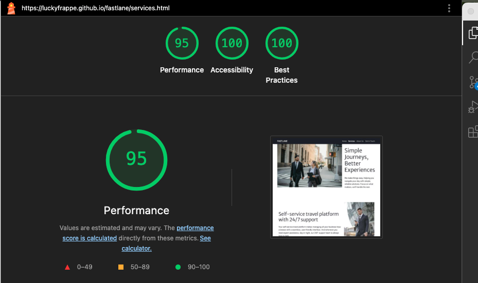

# FASTLANE Corporate Mobility - Testing Documentation

<a href="https://luckyfrappe.github.io/fastlane/" target="_blank" aria-labe="FASTLANE website opens in a new window on Github Pages">View FASTLANE on Github Pages</a>

## Contents
* [Automated Testing](#automated-testing)  
* [Manual Testing](#manual-testing)  
* [Bugs](#bugs)  
    * [Known Bugs](#known-bugs)  
    * [Solved Bugs](#solved-bugs)  

Quality assurance was a continuous part of this project's development lifecycle. Throughout the entire build process, I employed a periodically testing methodology to ensure the optimal performance and user experience of the FASTLANE website.

My primary focus during testing involved:

- Responsive Design Validation: Checks were performed across a spectrum of device sizes and orientations to confirm that all features and layouts adapted seamlessly, providing a consistent and intuitive experience regardless of screen dimensions.
- Feature Verification: Every implemented feature, from navigation elements to interactive forms and content display, was periodically tested to confirm flawless operation.

I actively utilized browser developer tools (such as Chrome Developer Tools) to resolve any issues promptly as they arose. This proactive approach ensured that all functionalities performed as intended, contributing to a robust and reliable user interface. Any identified discrepancies were addressed to guarantee that all aspects of the website operate perfectly.

### Automated Testing

<a href="https://luckyfrappe.github.io/fastlane/">Live site</a>

Automated testing involved the use of various external tools and validators to systematically check the website's code quality, performance, and accessibility.

**W3C HTML Validator**
The W3C Markup Validation Service was utilized to validate the HTML structure of each page, ensuring adherence to web standards.

  
Results

  

    Landing Page (Home): 
     
    Services Page: 
     
    About Page: 
     
    Contact Page: 
     
    Success Page: 
     
  

 

**CSS Validator**
The W3C CSS Validation Service was used to ensure the CSS stylesheets conform to standards.

  
Results

  

    
  

 

**Lighthouse**
Lighthouse, integrated into Chrome Developer Tools, was used to audit the performance, accessibility and best practices.
Landing Page (Home):

  
Results

  

    Landing Page (Home): 
     
     
    Services Page: 
     
     
    About Page: 
     
     
    Contact Page: 
     
     
    Success Page: 
     
    
  

 

**WAVE Accessibility Tool**
The WAVE Web Accessibility Evaluation Tool was utilized to identify accessibility errors on each page.

  
Results

  

    Landing Page (Home): 
     
    Services Page: 
     
    About Page: 
     
    Contact Page: 
     
    Success Page: 
     
  

### Manual Testing

| User Story | Expected Outcome | Testing Performed | Result | Pass/Fail |
|------------|------------------|-------------------|--------|-----------|
| First-time visitor | Site is accessible and easy to navigate | Tested across desktop, tablet, and mobile | Layout stable and responsive  | Pass |
| Potential B2B customer | Quickly understand the benefits | Viewed Benefits section on Landing Page | Clear and concise advantages shown  | Pass |
| Potential B2B client | View list of services | Checked Landing Page + Services Page link | Services listed and linked correctly  | Pass |
| Decision-maker | Assess company reliability | Reviewed About Us page | Unique value and testimonials displayed  | Pass |
| Lead | Easily reach out or book demo | Clicked CTA buttons | Redirects to Contact Page  | Pass |
| Returning visitor | Quickly find contact details | Viewed footer | Company info and social links visible  | Pass |

### Full Testing

The final check, all functionalities performed as expected. 

| Feature | Expected Outcome | Testing Performed | Result | Pass/Fail |
|---------|------------------|-------------------|--------|-----------|
| Navigation Bar | All links work, branding visible, burger menu functions | Tested on all devices | All functional | Pass |
| Footer | Social media and contact links work | Clicked each one | All correct destinations | Pass |
| Fonts & Colors | Consistent font and color scheme | Reviewed across all pages | Merriweather Sans & Roboto Flex used correctly | Pass |
| Hero Section | Responsive video without horizontal scroll | Viewed on all devices | Autoplay, muted, loop, inline iOS | Pass |
| Hero Text & CTA | Overlay text and button work | Checked both | Display and links correct | Pass |
| Service Teaser Cards | Proper display and link functionality | Clicked links | All functional | Pass |
| Elevate Section | Parallax effect works on desktop | Scrolled section | Working as expected (not on mobile) | Pass |
| Benefits Section | Cards display with icons, titles, text | Reviewed each card | Display correct | Pass |
| Hero Section | Title, text, and image display properly | Viewed on all devices | Displays correctly | Pass |
| Detailed Services | Blocks (Self-service, Policies, Booking, Expenses) are visible and responsive | Reviewed all blocks | Content and layout correct | Pass |
| Final CTA | "Get in Touch" button works | Clicked button | Redirect successful | Pass |
| Mission Section | Images and list items with icons display correctly | Viewed section | All content correct | Pass |
| Why FASTLANE Section | 3 cards display accurately | Reviewed cards | Content displays correctly | Pass |
| Testimonials | Testimonial cards display correctly | Viewed all cards | All readable and aligned | Pass |
| Final CTA | "Get in Touch" button works | Clicked button | Redirect successful | Pass |
| Required Fields Validation | Form should not submit without required fields | Tried empty form submit | Validation messages shown | Pass |
| Form Submission | Form submits and redirects | Submitted valid form | Redirected to Success Page | Pass |
| Responsiveness | Layout adapts across screen sizes | Viewed on multiple devices | Display correct | Pass |
| Thank You Message | Page loads with message | Submitted form | Thank-you message shown | Pass |
| Navigation Button | Home button redirects to home | Clicked button | Redirects correctly | Pass |

## BUGS

Many bugs were identified and successfully resolved throughout the development process as they arose.

### Known Bugs

- **iOS/Android Parallax Effect: The background-attachment:** fixed property in the .elevate section does not produce the intended parallax effect on iOS and some Android browsers, causing the background image to scroll with the content. This is a common mobile browser limitation.
- **"Why FASTLANE?" Section Card Stretching (Tablets):** On tablet viewports, the cards within the "Why FASTLANE?" section can stretch excessively, impacting the visual balance of the layout.

### Solved Bugs

- **Horizontal Scroll on Mobile:** 
Issue: The hero video section caused a horizontal scrollbar on mobile devices, indicating content overflowing to the right. 
Resolution: Applied margin-right: 0; to the containing Bootstrap .row and padding-right: 0; to the .video-repsonvise (likely intended as .video-responsive) wrapper. This explicitly removed any extra spacing that caused the overflow.
- **iOS Video Autoplay:**
Issue: Videos might not autoplay inline on iOS devices by default.
Resolution: Added the playsinline attribute to the video tag to enable inline autoplay on iOS.
- **CSS Header Color Specificity:**  
Issue: A previous CSS bug caused all h1 to h6 elements across the entire website to turn white due to an incorrect CSS selector (footer h1, h2, h3,...).  
Resolution: The CSS selector was refined to explicitly target only headings within the footer by repeating the footer parent selector for each heading tag (e.g., footer h1, footer h2, ...). (Note: This fix is applied in your CSS sheet, but the comment in HTML flags it as a past bug.)
- **Typo in Hero Section Class:** 
Issue: The hero-section element had a typo in its Bootstrap class: caontainer-fluid. 
Resolution: Corrected the class name to container-fluid and rewrote styling for the hero-video.

Back to [README.md](README.md)